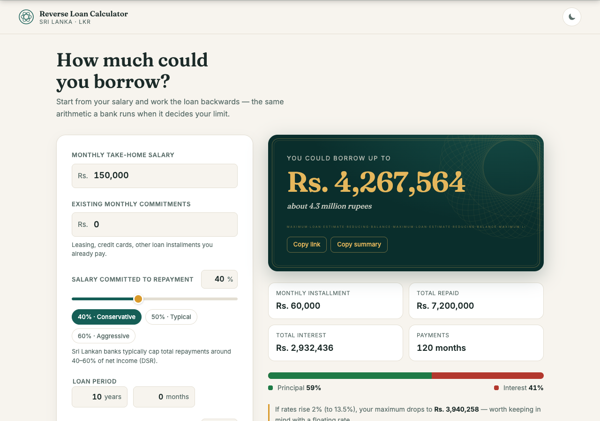
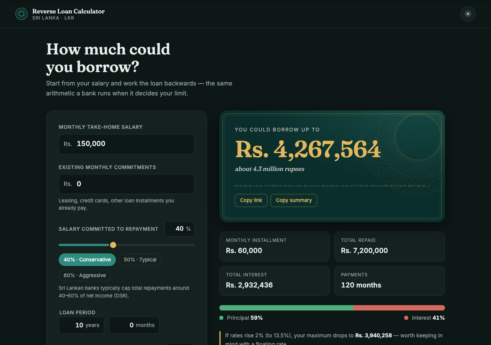

# Reverse Loan Calculator

A normal loan calculator takes a loan amount and tells you the installment. This tool works
**backwards**: enter your net salary and how much of it you can commit, and it calculates the
**maximum loan a bank would let you borrow** — instantly, in LKR, with the arithmetic banks
actually use.

**Live:** https://youvegotnigel.github.io/reverse-loan-calculator/

Everything runs in your browser. No backend, no analytics, no cookies — nothing you enter
leaves your machine.

## Screenshots

| Light                                | Dark                               |
| ------------------------------------ | ---------------------------------- |
|  |  |

## Features

- **Maximum loan as the hero figure** — a banknote-styled result plate with a guilloche
  rosette, animated count-up, and a plain-words line ("about 8.8 million rupees") using
  Sri Lankan conventions (lakhs and millions)
- **Live recalculation** on every input change — no submit button
- **Inputs:** net monthly salary, % of salary committed (slider ⇄ number, with DSR presets
  40/50/60%), existing monthly commitments (deducted from capacity), loan period in
  years + months, annual interest rate (reducing balance, slider ⇄ number)
- **Results:** monthly installment, total repaid, total interest, number of payments,
  principal-vs-interest split bar with percentages
- **Rate stress test** — shows what a 2% rate rise does to your maximum, since most
  Sri Lankan loans float with AWPLR
- **Balance decay chart** — SVG area chart of the remaining balance, with hover tooltip
- **Amortization table** — yearly or month-by-month view (payments in Sri Lanka are
  monthly), with principal paid, interest paid, and remaining balance
- **Shareable URLs** — inputs live in the query string; "Copy link" and "Copy summary"
  (plain text, ready for WhatsApp or email)
- **Print-ready** — a clean one-page summary via your browser's print dialog
- **Dark mode** — follows your system, with a manual toggle
- Fully responsive, keyboard-accessible, WCAG AA contrast, `prefers-reduced-motion`
  respected, results announced via `aria-live`

## The formula

The tool inverts the standard annuity (EMI) formula. If a bank sees you can pay
installment `M` per month for `n` months at monthly rate `i`, the largest principal `P`
that installment can service on a reducing balance is:

```
P = M × (1 − (1 + i)^−n) / i        (i > 0)
P = M × n                            (i = 0)
```

where:

- `M` = salary × committed% − existing commitments (your monthly repayment capacity)
- `i` = annual rate ÷ 12 ÷ 100
- `n` = years × 12 + months

This is the exact inverse of the EMI formula `M = P·i / (1 − (1 + i)^−n)`, so the numbers
round-trip with what banks quote. The amortization schedule then applies standard
reducing-balance arithmetic: each month's interest is `balance × i`, the rest of the
installment repays principal, and the final payment absorbs rounding drift so the balance
lands on exactly zero.

## Local development

Requires Node 22 (see `.nvmrc`).

```bash
nvm use          # or install Node 22 any way you like
npm install
npm run dev      # dev server with hot reload
```

Other scripts:

```bash
npm test         # Vitest unit tests for the calculation engine
npm run lint     # ESLint + Prettier check (zero-error policy)
npm run build    # type-check + production build to dist/
npm run preview  # serve the production build locally
```

The calculation engine (`src/engine/`) is pure TypeScript with no DOM access and is fully
unit-tested — annuity math, the 0% edge case, schedule generation, rounding, input
validation and clamping, LKR/plain-words formatting, and URL state round-trips. UI code
(`src/ui/`) only renders and binds events.

## Deployment

Pushes to `main` trigger the GitHub Actions workflow (`.github/workflows/deploy.yml`):
install → lint → test → build → deploy to GitHub Pages via `actions/deploy-pages`.

One-time setup for a fork: **Settings → Pages → Source → GitHub Actions**. The Vite
`base` is set to `/reverse-loan-calculator/` in `vite.config.ts` — change it if your
repository has a different name.

## Roadmap (V2 candidates)

Tracked here so they don't get lost:

| Feature                             | Sketch                                                    | Effort |
| ----------------------------------- | --------------------------------------------------------- | ------ |
| Max property price mode (LTV)       | Down-payment % → max property price alongside max loan    | M      |
| Bank/rate comparison                | Three rate columns showing max loan under each            | M      |
| PWA / offline support               | Manifest + service worker; the app is fully static        | M      |
| English / Sinhala / Tamil           | Language toggle with self-hosted Noto Sinhala/Tamil fonts | L      |
| Scenario compare                    | Pin a scenario, compare against current (localStorage)    | M      |
| Loan-type rate presets              | Illustrative housing / personal / vehicle rate chips      | S      |
| Numeric lakh/million display toggle | Switch grouping convention for all figures                | S      |
| Early settlement explorer           | Extra-payment slider showing interest saved               | M      |

## Disclaimer

Estimates only. Actual eligibility, rates, fees, and DSR policies vary by bank and change
with AWPLR. This tool is not financial advice.
